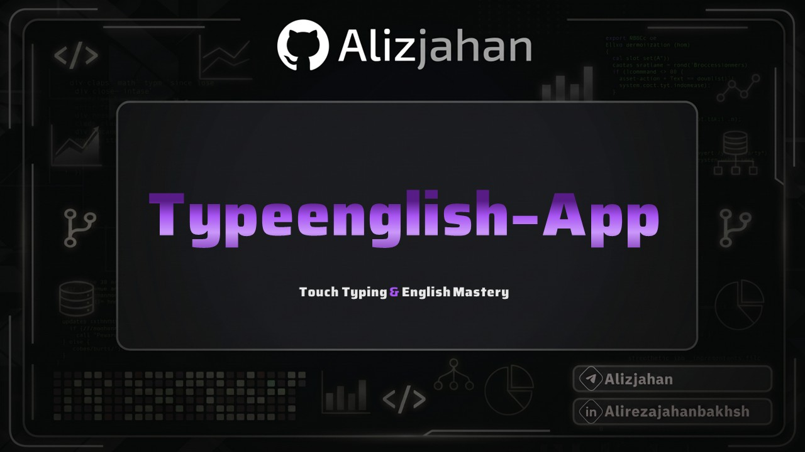

<div align="center">



# TypeEnglish App
### Interactive English Typing, Listening Dictation, and Spaced Repetition Platform

[](https://reactjs.org/)
[](https://www.typescriptlang.org/)
[](https://vitejs.dev/)
[](https://tailwindcss.com/)
[](https://opensource.org/licenses/MIT)

[Overview](#overview) • [Key Features](#key-features) • [Installation](#installation--setup) • [Architecture](#architecture--tech-stack) • [Progress Tracking](#progress-tracking)

</div>

---

## Overview

TypeEnglish is a desktop-first language learning application designed to bridge the gap between passive reading and active production. By enforcing typing as the primary interaction method, the platform builds motor memory, grammatical precision, and rapid vocabulary recall.

Operating entirely as an offline, local-first application, TypeEnglish stores all user progress securely in the browser, requiring no external server connection or account dependency.

---

## Key Features

### 1. Vocabulary Training (4000 Essential English Words)
- **Leitner Spaced Repetition:** Reviews are scheduled dynamically across Boxes 1 through 6 based on recall retention.
- **Rich Context:** Every entry provides native audio pronunciation, International Phonetic Alphabet (IPA) transcriptions, contextual imagery, definitions, and model sentences.
- **Active Recall:** Prompts require typing the target word directly from contextual comprehension.

### 2. Listening and Dictation
- Native audio transcription practice across CEFR levels (A1 to C1).
- Automatic grading engine with tolerance for punctuation and casing nuances.
- Replay counters and word-level accuracy diagnostics.

### 3. Speed and Touch Typing
- Muscle memory development focused on high-frequency English letter combinations, syllables, and syntax.
- Real-time Words Per Minute (WPM) tracking, accuracy metrics, and visual key placement guidance.

### 4. Grammar Typing
- Contextual fill-in-the-blank exercises requiring full sentence typing.
- Structured progression covering fundamental to advanced grammatical patterns.

### 5. Unified Review Dashboard
- Automated aggregation of weak points across all four learning modules.
- Single queue combining due Leitner vocabulary, incorrect grammar selections, low-accuracy listening exercises, and speed typing practice recommendations.

---

## Installation & Setup

### Prerequisites
- Node.js (version 18.0 or higher)
- npm or yarn

### Quick Start
```bash
# Clone the repository
git clone https://github.com/Alizjahan/Typeenglish-App.git

# Navigate to the project directory
cd Typeenglish-App

# Install dependencies
npm install

# Start the local development server
npm run dev
```

### Production Build
```bash
npm run build
npm run preview
```

---

## Architecture & Tech Stack

TypeEnglish is built on a local-first engineering foundation:

- **Frontend:** React 18 with TypeScript for type-safe UI architecture.
- **Styling:** Tailwind CSS with a clean, dark-mode prioritized interface.
- **Build System:** Vite for fast Hot Module Replacement and bundle optimization.
- **Persistence:** Custom storage service layer abstracting browser local storage.
- **Audio Delivery:** Pre-rendered static assets paired with Web Speech API fallbacks for low-latency playback.

### Data Privacy & Offline Portability
All user progress, statistics, and review intervals are stored locally. Full backups can be exported as structured JSON and imported across devices at any time without cloud transmission.

---

## Progress Tracking

- **Daily Study Goals:** Configurable daily targets ranging from 10 to 60 minutes.
- **Streak & Consistency:** Daily practice logging and habit tracking.
- **Performance Analytics:** Independent accuracy, mastery, and volume metrics across all four skill modules.

---

## Author

**Alireza Jahanbakhsh**
- GitHub: [@Alizjahan](https://github.com/Alizjahan)
- Email: alizjahanbakhsh@gmail.com

---

<div align="center">
  <sub>TypeEnglish &bull; Desktop-First English Learning Platform</sub>
</div>
